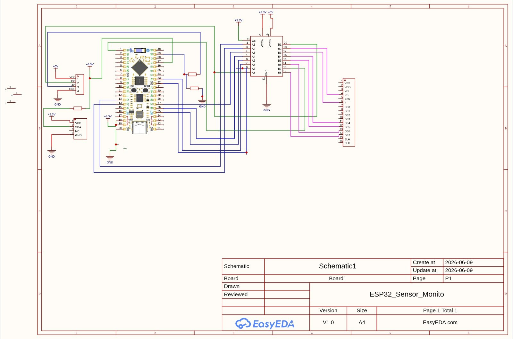
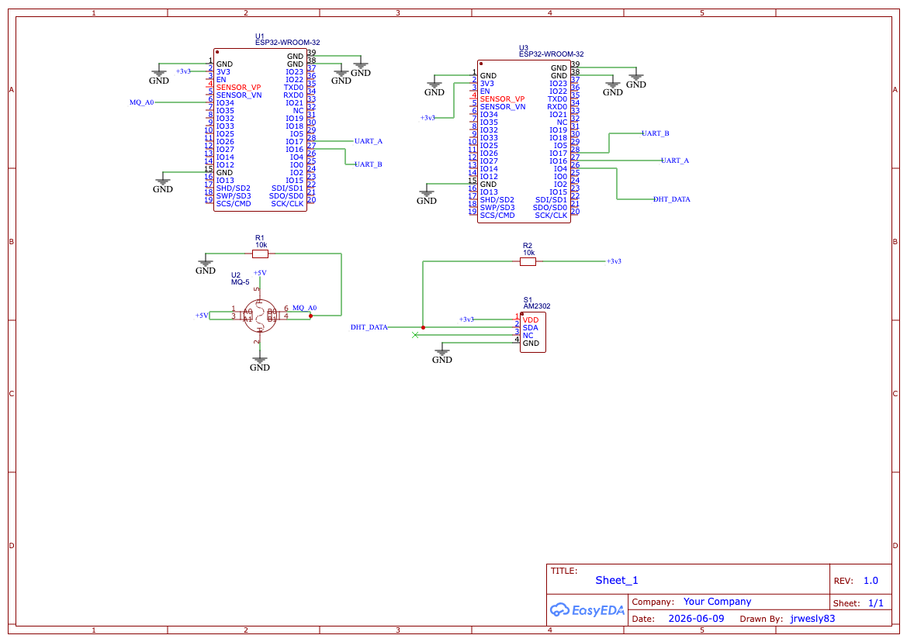
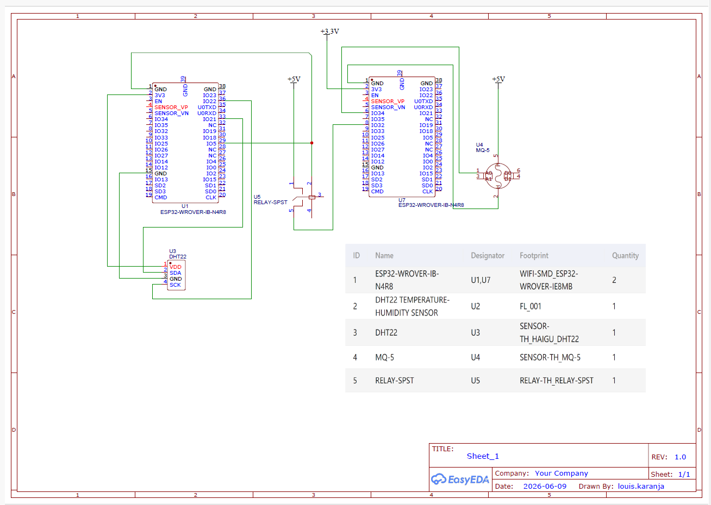

# ICS 4111: Embedded Systems & IoT - GROUP 8 DOREMI
## Semester Project: Deliverable 1 - Component Selection, Requirements and Schematic Designs Compiled by Terrence Cheruiyot

**Objective:** Identify requirements that support individual flower growth and develop schematic designs of embedded devices

---

## 1. Flower Environmental Requirements Done By Emmanuel Keter

**Flower:** Roses

| Parameter | Optimal Range / Type | Description |
|-----------|----------------------|-------------|
| a. Temperature | 15°C – 26°C | Roses grow best in mild temperatures. Below 10°C slows growth, while above 30°C can stress the plant and reduce flowering. |
| b. Relative Humidity | 60% – 70% | Moderate humidity supports transpiration and prevents excessive fungal diseases that occur in very high humidity. |
| c. Soil Type | Loamy, well-drained soil rich in organic matter | Ideal soil retains moisture while allowing excess water to drain, preventing root rot. |
| d. Soil Moisture Content | 60% – 70% (moderately moist) | Soil should remain consistently moist but not waterlogged. Overwatering leads to root diseases. |
| e. Soil pH Range | 6.0 – 6.5 (slightly acidic) | Ensures optimal nutrient absorption, especially nitrogen, phosphorus, and potassium. |
| f. Sunlight Exposure | 6 – 8 hours per day (full sunlight) | Roses require direct sunlight for proper photosynthesis and flower production. |

---

## 2. Hardware Components Done By Jude Makau

### Microcontroller
- ESP32S DevKit WiFi + BLE Module (30-Pin)

### Sensors
- DHT22 (AM2302) Temperature and Humidity Sensor
- Soil Moisture Sensor (Capacitive Soil Moisture Sensor v1.2)
- Soil pH Sensor Module
- Light Sensor / Photoresistor (LDR) Module
- MQ-5 LPG, Natural Gas, and Coal Gas Sensor

### Actuators & Display
- 1.3" White IIC 128X64 OLED LCD Display
- 5V 1-Channel Low Level Trigger Relay Module

### Prototyping, Power & Wiring
- Full-Sized MB102 Breadboard
- Premium Jumper Wires (Male-to-Male, Female-to-Male, Female-to-Female)
- Micro-USB Cable
- 5V 2A Power Adapter (or Power Bank)
- 10k Ohm Resistors

---

## 3. Component Datasheets and Reference Webpages Done By Ian Kiome

### a. 1.3" White IIC 128X64 OLED LCD
- **Datasheet (SH1106 Controller):** [Pololu SH1106 PDF](https://www.pololu.com/file/0J1813/SH1106.pdf)
- **Datasheet (SSD1306 Controller):** [Adafruit SSD1306 PDF](https://cdn-shop.adafruit.com/datasheets/SSD1306.pdf)

### b. ESP32S DevKIT WIFI + BLE Module (30Pin)
- **Datasheet (ESP32-WROOM-32 Core Module):** [Espressif Official Datasheet PDF](https://www.espressif.com/sites/default/files/documentation/esp32-wroom-32_datasheet_en.pdf)
- **Product Webpage / Pinout Reference:** [Espressif DevKitC Hardware Reference](https://docs.espressif.com/projects/esp-idf/en/latest/esp32/hw-reference/esp32/get-started-devkitc.html)

### c. DHT22 AM2302 Temperature and Humidity Sensor
- **Datasheet:** [Aosong AM2302 / DHT22 PDF](https://www.sparkfun.com/datasheets/Sensors/Temperature/DHT22.pdf)

### d. MQ-5 LPG, Natural Gas, Coal Gas Sensor
- **Datasheet (Hanwei Electronics MQ-5):** [Sparkfun MQ-5 PDF](https://www.sparkfun.com/datasheets/Sensors/Biometric/MQ-5.pdf)

### e. 5V 1-Channel Low Level Trigger Relay Module
- **Datasheet (Songle SRD-05VDC-SL-C):** [Components101 Songle Relay PDF](https://components101.com/sites/default/files/component_datasheet/5V%20Relay%20Datasheet.pdf)
- **Product Webpage / Reference:** [Components101 Relay Module Overview](https://components101.com/switches/5v-relay-module-pinout-features-applications-working-datasheet)

---

## 4. Schematic Circuit Diagrams

### Design A: Single ESP32S with All Sensors and LCD Done By Mary Queenvine 

**Architecture:** 1 ESP32S connected to 1 MQ-5, 1 DHT22 and 1 LCD

**Circuit Configuration:**
- **Microcontroller:** ESP32-WROOM-32 serves as the main processing unit
- **Temperature & Humidity Sensing:** DHT22 sensor connected to ESP32 for environmental monitoring
- **Gas Detection:** MQ-5 sensor interfaced with ESP32 for LPG/natural gas/coal gas detection
- **Display:** 1.3" White IIC 128X64 OLED LCD connected to ESP32 via I2C protocol for real-time data visualization
- **Power Supply:** Central +3.3V and +5V power distribution with appropriate grounding
- **Signal Conditioning:** Includes resistors for proper signal voltage levels and protection

**Component Details:**
| Component | Connection | Purpose |
|-----------|-----------|---------|
| ESP32-WROOM-32 | Central Hub | Main microcontroller for sensor data processing |
| DHT22 (AM2302) | Analog/Digital Input | Temperature and humidity measurement |
| MQ-5 Sensor | Analog Input (A0) | Gas concentration detection |
| 1.3" OLED LCD (IIC 128X64) | I2C Interface (SDA/SCL) | Data display and monitoring interface |
| Power Distribution | +3.3V / +5V / GND | Power supply for all components |

**Schematic Diagram:**

**Key Features:**
- All sensors integrated on a single ESP32 microcontroller
- I2C communication protocol simplifies wiring for OLED display
- Centralized monitoring of temperature, humidity, and gas levels
- Real-time display of all environmental parameters
- Most straightforward and compact design configuration
- Ideal for single-location monitoring systems

---

### Design B: Two ESP32S Modules Communicating (MQ-5 and DHT22 Separated) Done By Wesley Ryan

**Architecture:** 1 ESP32S connected to 1 MQ-5 interfaced directly with another ESP32S connected to 1 DHT22

**Circuit Configuration:**
- **Module 1 (Left - MQ-5 Module):** ESP32-WROOM-32 dedicated to gas sensing with MQ-5 LPG/Natural Gas/Coal Gas sensor
  - MQ-5 analog output (A0) connected to ESP32 analog input for gas concentration measurement
  - Signal conditioning with resistors (R1, R2) for proper voltage levels
  - Voltage divider circuit for signal protection
  
- **Module 2 (Right - DHT22 Module):** ESP32-WROOM-32 dedicated to environmental sensing with DHT22 temperature and humidity sensor
  - DHT22 digital output connected to ESP32 GPIO pin (DHT_DATA)
  - Pull-up resistor (R2) for digital signal line
  
- **Inter-Module Communication:** UART serial communication (UART_A and UART_B) connecting the two ESP32 modules
  - TX/RX lines for bidirectional data exchange
  - Allows real-time sensor data sharing between modules
  
- **Power Supply:** Independent +3.3V and GND for each module with shared communication ground

**Component Details:**
| Component | Module | Connection | Purpose |
|-----------|--------|-----------|---------|
| ESP32-WROOM-32 | 1 (Left) | Central Hub | Main microcontroller for gas detection processing |
| ESP32-WROOM-32 | 2 (Right) | Central Hub | Main microcontroller for environmental data processing |
| MQ-5 Sensor | 1 | Analog Input (A0) | Gas concentration detection |
| DHT22 (AM2302) | 2 | Digital GPIO | Temperature and humidity measurement |
| Resistor R1 | 1 | Signal Conditioning | Voltage divider for MQ-5 output |
| Resistor R2 | Both | Pull-up / Signal Line | Digital signal line stabilization for DHT22 |
| UART Interface | Both | Serial Communication | Data exchange between the two modules |

**Schematic Diagram:**

**Key Features:**
- Modular architecture with sensor-specific ESP32 modules
- UART serial communication protocol enables independent sensor processing- Distributed processing reduces single-point failure risk
- Each module optimized for its specific sensor type
- Scalable design allows for future expansion with additional sensors
- Ideal for systems requiring separated sensor modules and data aggregation

---

### Design C: Two ESP32S Modules Connected via Relay (DHT22 Controlling MQ-5) Done By Louis Karanja

**Architecture:** 1 ESP32S connected to 1 DHT22 connected to 1 relay which is connected to another ESP32S connected to 1 MQ-5

**Circuit Configuration:**
- **Module 1 (Left - DHT22 Module):** ESP32-WROVER-IB-N4R8 (U1) connected to DHT22 Temperature & Humidity Sensor (U2, U3)
- **Relay Control:** The DHT22 module triggers a RELAY-SPST (U5) based on environmental conditions
- **Module 2 (Right - MQ-5 Module):** ESP32-WROVER-IB-N4R8 (U7) connected to MQ-5 LPG/Gas Sensor (U4)
- **Power Supply:** Both modules powered at +5V and +3.3V with appropriate grounding

**Component Details (from BOM):**
| ID | Name | Designator | Footprint | Quantity |
|----|------|-----------|-----------|----------|
| 1 | ESP32-WROVER-IB-N4R8 | U1, U7 | WIFI-SMD ESP32-WROVER-IE8MB | 2 |
| 2 | DHT22 Temperature-Humidity Sensor | U2 | FL_001 | 1 |
| 3 | DHT22 | U3 | SENSOR-TH_HAIGU_DHT22 | 1 |
| 4 | MQ-5 | U4 | SENSOR-TH_MQ-5 | 1 |
| 5 | RELAY-SPST | U5 | RELAY-TH_RELAY-SPST | 1 |

**Schematic Diagram:**

**Key Features:**
- Relay acts as an interface between the two ESP32 modules
- DHT22 sensor on the primary ESP32 monitors temperature and humidity
- MQ-5 sensor on the secondary ESP32 monitors gas levels
- Relay allows conditional control of the gas monitoring module based on environmental conditions
