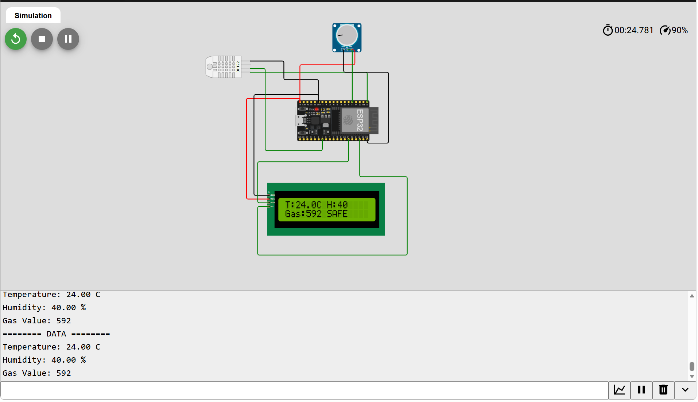
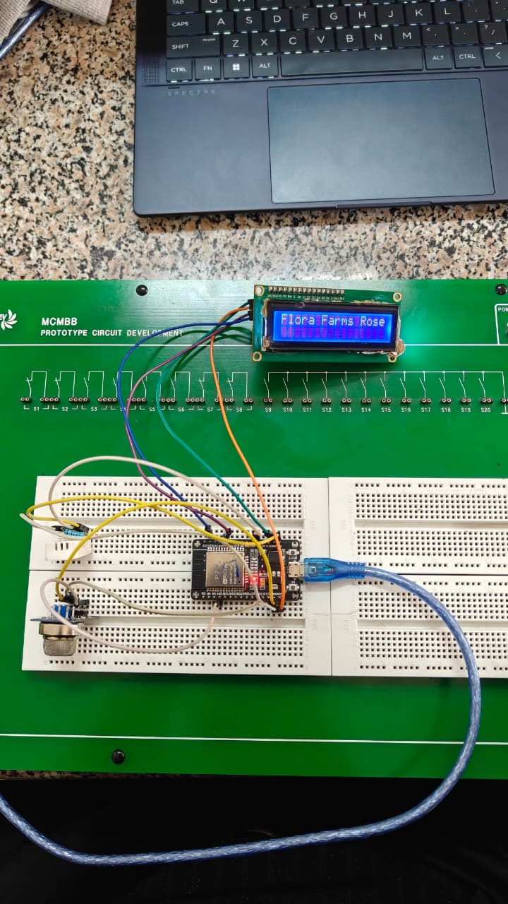
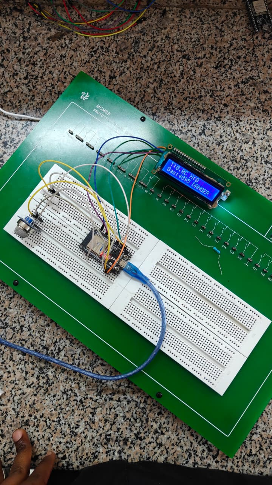
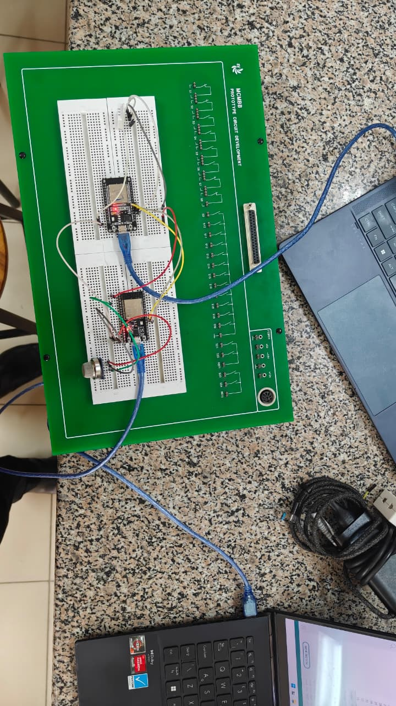
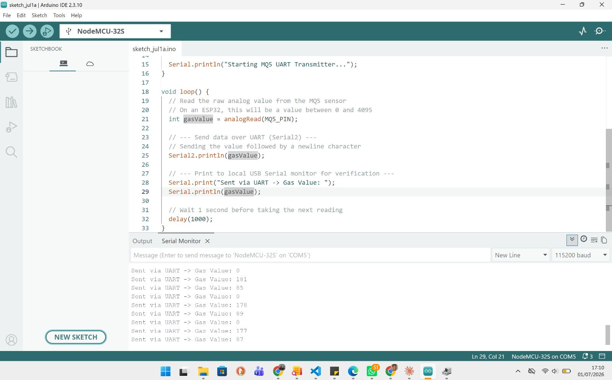
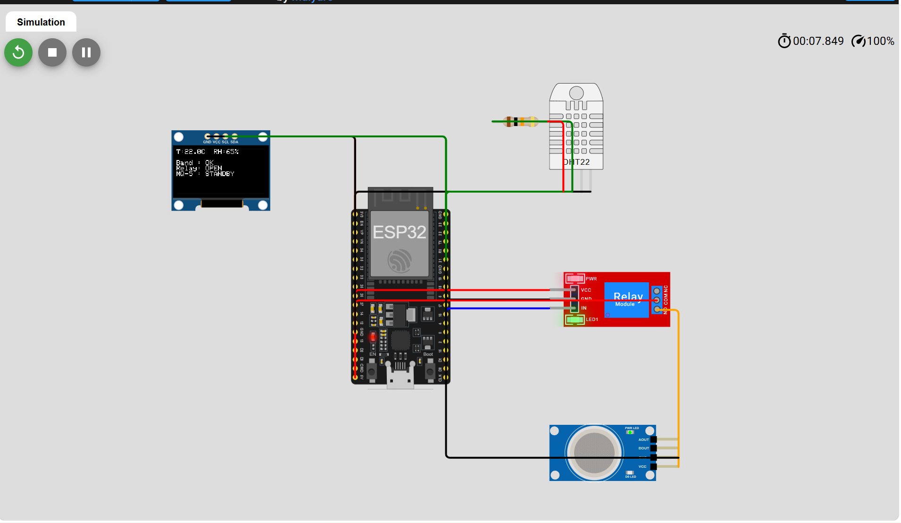

# ICS 4111: Embedded Systems & IoT - GROUP 8 DOREMI
# Semester Project: Deliverable 2 – Physical and Simulated Prototypes

---

## Objective

Develop physical and simulated ESP32 prototypes from the Deliverable 1 architectures. The work demonstrates:

- sensor integration,
- analog data acquisition,
- inter-device communication,
- relay control,
- real-time monitoring and display.

---

## Prototype Overview

| Prototype | Implementation | Status |
| --- | --- | --- |
| A | Single ESP32 with DHT22, MQ-5 analog input and 16x2 I2C LCD | Physical + simulation |
| B | Two ESP32 modules exchanging data over UART | Physical |
| C | Relay-mediated conditional gas monitoring | Simulation |

---

## Important Notice: MQ-5 Sensor Substitution in Wokwi

Wokwi does not include an actual MQ-5 gas sensor model. For simulated prototypes, we substituted a 10k potentiometer to provide a variable analog voltage input.

### Why this substitution is valid

- The MQ-5 sensor outputs an analog voltage proportional to gas concentration.
- A potentiometer also provides a variable analog voltage to the ESP32 ADC.
- The prototype logic focuses on ADC read, threshold classification, and relay activation.

In the final physical build, the actual MQ-5 sensor must replace the potentiometer.


---

# Prototype A: Single ESP32 with DHT22, MQ-5 analog input and 16x2 I2C LCD

## Implementation

- Physical: yes
- Simulation: yes
- Wokwi link: https://wokwi.com/projects/468240836308686849

## Components

- ESP32 DevKit module
- DHT22 temperature and humidity sensor
- 10k potentiometer (simulation substitute for MQ-5)
- 16x2 I2C LCD display
- Breadboard, jumper wires, USB cable

## Pin Connections

### DHT22

```text
VCC → 3.3V
GND → GND
DATA → GPIO4
```

### Potentiometer (MQ-5 Simulation)

```text
Left → GND
Right → 3.3V
Wiper → GPIO34
```

### LCD I2C

```text
VCC → 5V
GND → GND
SDA → GPIO21
SCL → GPIO22
```

## Functional Description

The ESP32 reads:

- temperature from DHT22,
- humidity from DHT22,
- analog gas value from the potentiometer.

The board displays all readings on the LCD and prints them to the serial console.

## Simulation Results


- Example captured values:
  - `Temperature: 24.00 C`
  - `Humidity: 40.00 %`
  - `Gas Value: 592`

## Physical Evidence


> Note: the physical prototype uses the same wiring scheme as the simulation. The main difference is the use of the actual hardware layout on the breadboard.

---

# Prototype B: Two ESP32 Modules Communicating via UART

## Implementation

- Physical: yes
- Simulation: no

## Components

- 2 × ESP32 DevKit modules
- DHT22 sensor
- MQ-5 sensor or potentiometer substitute
- USB cables, breadboard, jumper wires

## Architecture

- ESP32 A: gas sensing node
- ESP32 B: environmental sensing node
- UART connects the two modules for data exchange.

## Pin Connections

### ESP32 A (Gas node)

```text
MQ-5 analog → GPIO34
TX → GPIO17
RX → GPIO16
```

### ESP32 B (DHT22 node)

```text
DHT22 DATA → GPIO4
TX → GPIO17
RX → GPIO16
```

### Common wiring

```text
ESP32 A GND ↔ ESP32 B GND
```

## Functional Description

ESP32 B reads temperature and humidity from DHT22 and sends those readings to ESP32 A. ESP32 A reads the gas value and receives environmental data from ESP32 B, demonstrating distributed sensing and inter-board communication.

## Physical Evidence




> Note: Prototype B validates the two-node architecture from Deliverable 1 and shows the planned UART-based data exchange. If you want, we can add a short schematic-style table showing the UART message format.

---

# Prototype C: Relay-mediated conditional gas monitoring (simulation)

## Implementation

- Physical: no
- Simulation: yes
- Wokwi link: https://wokwi.com/projects/468314387214351361

## Components

- ESP32 DevKit module
- DHT22 sensor
- Relay module
- 10k potentiometer (MQ-5 simulation)
- 128x64 OLED display (simulation)
- Breadboard, jumper wires

## Architecture

The primary ESP32 reads the DHT22 and controls the relay. When environmental values move outside the rose-optimal band, the relay closes and the gas monitoring node becomes active.

## Pin Connections

```text
DHT22 DATA → GPIO15
RELAY IN → GPIO4
MQ-5 analog → GPIO34
OLED SDA → GPIO21
OLED SCL → GPIO22
```

## Control Logic

- Rose optimal range:
  - temperature 15–26 °C
  - humidity 60–70 %
- If the environment is outside the range, the relay closes and MQ-5 monitoring activates.
- If the environment is inside the range, the relay opens and MQ-5 monitoring remains in standby.

## Simulation Evidence



## Code Snippet

```cpp
#define DHT_PIN 15
#define DHT_TYPE DHT22
#define RELAY_IN 4
#define GAS_AO 34

bool outOfBand = (temp < 15.0 || temp > 26.0 || hum < 60.0 || hum > 70.0);
digitalWrite(RELAY_IN, outOfBand ? LOW : HIGH);

if (outOfBand) {
  // gas monitoring active
  display.println("Relay: CLOSED");
} else {
  display.println("Relay: OPEN");
}
```

> Note: the Wokwi simulation demonstrates the relay decision and the gas input logic. The full physical design is still two-node with relay-controlled power gating.

---

# Challenges and Design Notes

## 1. MQ-5 sensor unavailable in Wokwi

- Problem: no native MQ-5 component in the simulator.
- Mitigation: used a potentiometer to generate a variable ADC voltage.
- Result: the ADC logic and warning thresholds were validated successfully.

## 2. Wokwi relay and multi-node limitation

- Problem: Wokwi supports only one microcontroller per project in this simulation.
- Mitigation: Prototype C uses a single ESP32 to demonstrate the relay gating behavior and the conditional activation logic.
- Result: the concept of relay-mediated gas monitoring is documented and proven.

## 3. UART communication setup

- Problem: ESP32-to-ESP32 communication requires correct TX/RX pairing and a common ground.
- Solution: cross-wire TX to RX and share GND between both modules.
- Result: the distributed sensor architecture is supported by the design.

## 4. Display consistency

- Prototype A uses a 16x2 I2C LCD display for the physical prototype.
- Prototype C simulation uses an OLED display to show the same monitoring concept.
- Both display interfaces use I2C communication.

---

# Conclusion

The completed prototypes show that Deliverable 1 architecture can be implemented in both physical and simulated forms. Prototype A provides a working single-board monitor. Prototype B proves modular UART communication between ESP32 nodes. Prototype C validates relay-based conditional activation of gas monitoring.

The report includes all published Wokwi links, simulation evidence, and physical breadboard photographs to support evaluation.


---

# Evidence of Group Work

## GitHub Repository

```text
https://github.com/EKR4T/Semester-Project
```


### Team Collaboration Evidence


---

# Conclusion

Three embedded system architectures were successfully implemented and simulated using ESP32 microcontrollers. The systems demonstrated environmental monitoring, data display, inter-device communication, and relay-based control mechanisms.

Although the MQ-5 sensor was unavailable in the Wokwi simulator, a potentiometer was successfully used as a substitute to emulate gas concentration readings and validate system functionality. The results confirmed that the proposed architectures can support intelligent environmental monitoring applications such as greenhouse automation and flower growth monitoring systems.