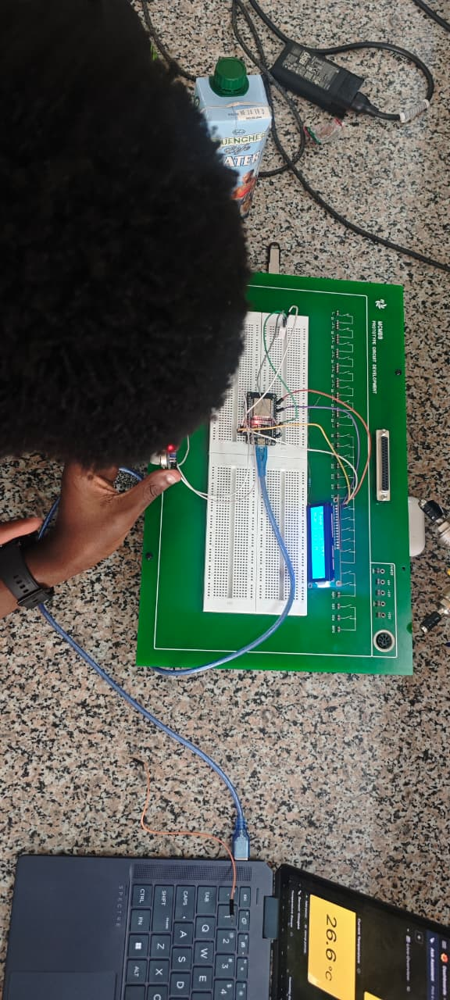
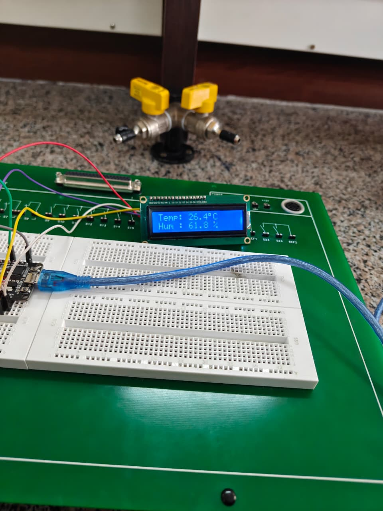
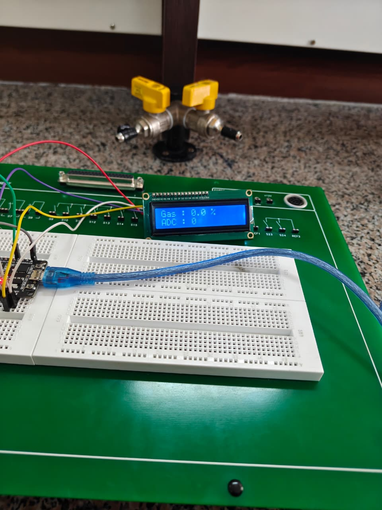
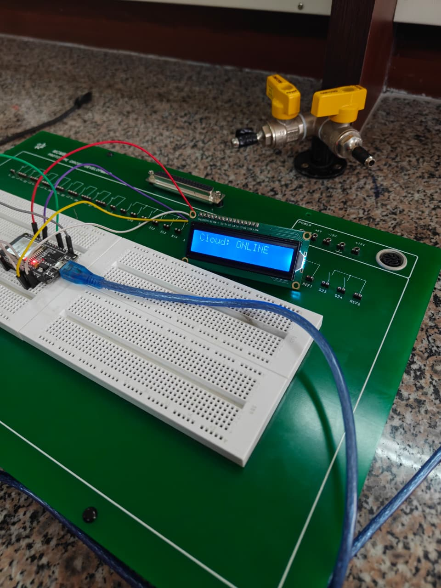
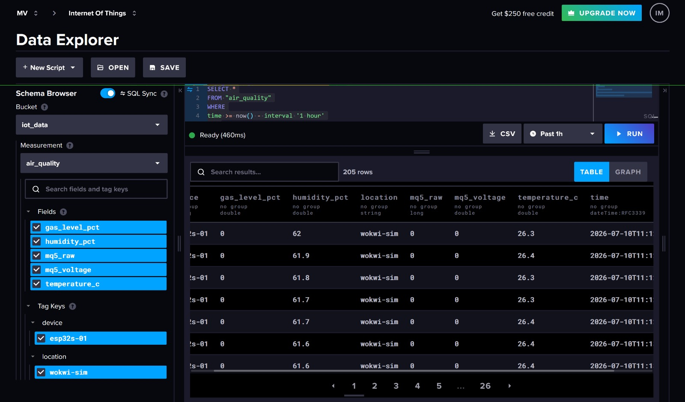
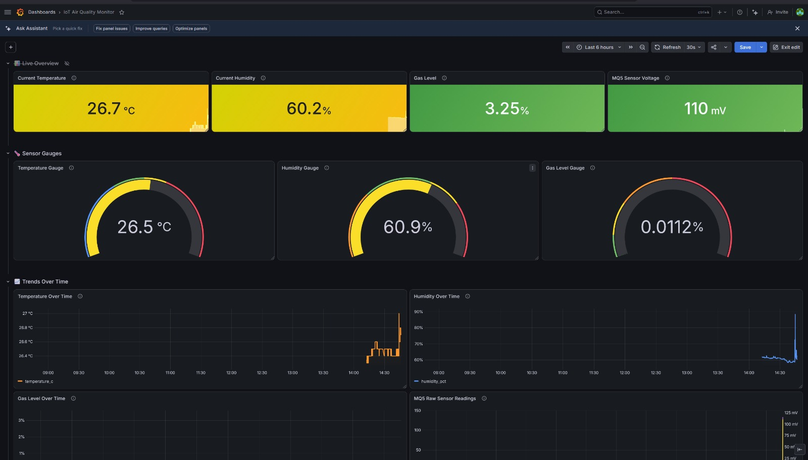
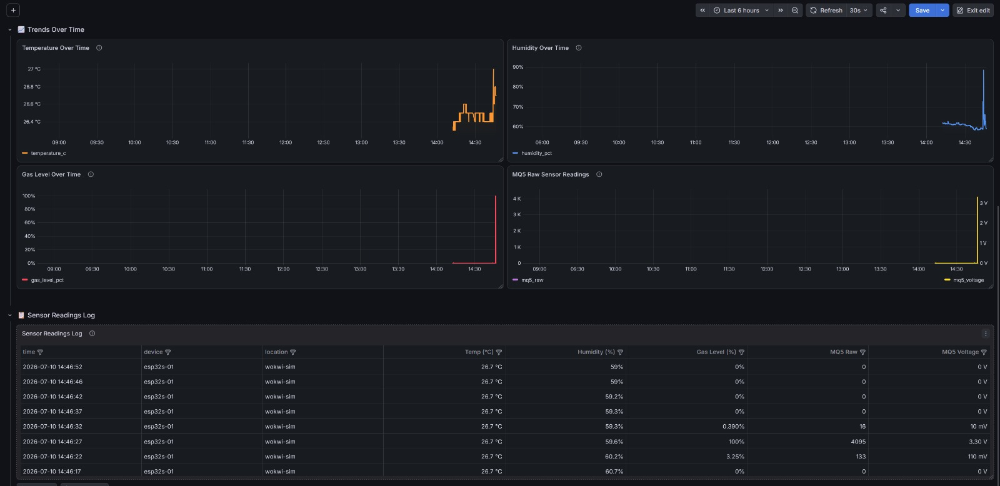

# ICS 4111: Embedded Systems & IoT - GROUP 8 DOREMI
# Semester Project: Deliverable 3 – Cloud Data Transmission & Visualisation

---

## Objective

Transmit and visualise sensor data on cloud platforms, building on the Deliverable 1 architecture and the Deliverable 2 physical prototype.

---

## 1. Prototype Implementation

- **Physical:** yes
- **Simulation:** no
- **Architecture:** 1 ESP32S connected to 1 MQ-5, 1 DHT22, and 1 16x2 LCD (matching Deliverable 1 Design A / Deliverable 2 Prototype A).

### Components

- ESP32 DevKit module
- DHT22 temperature and humidity sensor
- MQ-5 gas sensor
- 16x2 I2C LCD display
- Breadboard, jumper wires, USB cable, Wi-Fi network for cloud connectivity

### Functional Description

The ESP32 reads temperature and humidity from the DHT22 and gas concentration from the MQ-5, displays the readings on the LCD, and pushes each reading to an InfluxDB Cloud time-series bucket over Wi-Fi. The LCD also reports live connectivity status ("Cloud: ONLINE") once the upload succeeds.

> Note: readings in the InfluxDB/Grafana data are tagged `location: wokwi-sim`. This is a leftover tag name from earlier simulation testing — the data below was actually captured from the physical breadboard prototype, not a Wokwi simulation. The tag should be renamed (e.g. to `physical` or `lab-bench`) in a future revision to avoid confusion.

### Physical Evidence






- Example captured values:
  - `Temp: 26.4°C`
  - `Hum: 61.8%`
  - `Gas: 0.0% / ADC: 0`
  - `Cloud: ONLINE`

---

## 2. Cloud Data Storage — InfluxDB

Sensor data is stored in an InfluxDB Cloud time-series bucket.

| Setting | Value |
|---|---|
| Bucket | `iot_data` |
| Measurement | `air_quality` |
| Fields | `temperature_c`, `humidity_pct`, `gas_level_pct`, `mq5_raw`, `mq5_voltage` |
| Tags | `device: esp32s-01`, `location: wokwi-sim` (see note above) |



The Data Explorer query above (`SELECT * FROM "air_quality" WHERE time >= now() - interval '1 hour'`) returns 205 stored rows over the past hour, confirming sensor data is being continuously written to the time-series database.

---

## 3. Cloud Visualisation — Grafana

A Grafana dashboard ("IoT Air Quality Monitor") was built on top of the InfluxDB bucket, with more than the required 3 visualisations:

| Panel | Type | Purpose |
|---|---|---|
| Current Temperature / Humidity / Gas Level / MQ5 Sensor Voltage | Stat panels | At-a-glance live readings |
| Temperature / Humidity / Gas Level Gauges | Gauge panels | Threshold-coded live readings |
| Temperature Over Time | Time series | Temperature trend |
| Humidity Over Time | Time series | Humidity trend |
| Gas Level Over Time | Time series | Gas concentration trend |
| MQ5 Raw Sensor Readings | Time series | Raw ADC/voltage trend |
| Sensor Readings Log | Table | Row-level log of stored readings |




---

## Evidence of Group Work

### GitHub Repository

```text
https://github.com/EKR4T/Semester-Project
```

### Team Collaboration Evidence


---

## Conclusion

The Deliverable 1 architecture (1 ESP32S + 1 MQ-5 + 1 DHT22 + 1 LCD) was implemented as a full physical prototype and connected to an InfluxDB Cloud time-series bucket over Wi-Fi. A Grafana dashboard visualises the stored data across stat panels, gauges, time-series trend charts, and a readings log — exceeding the minimum of 3 required visualisations. The physical LCD confirms live cloud connectivity ("Cloud: ONLINE"), and the InfluxDB Data Explorer confirms continuous data storage (205 rows in the past hour).
